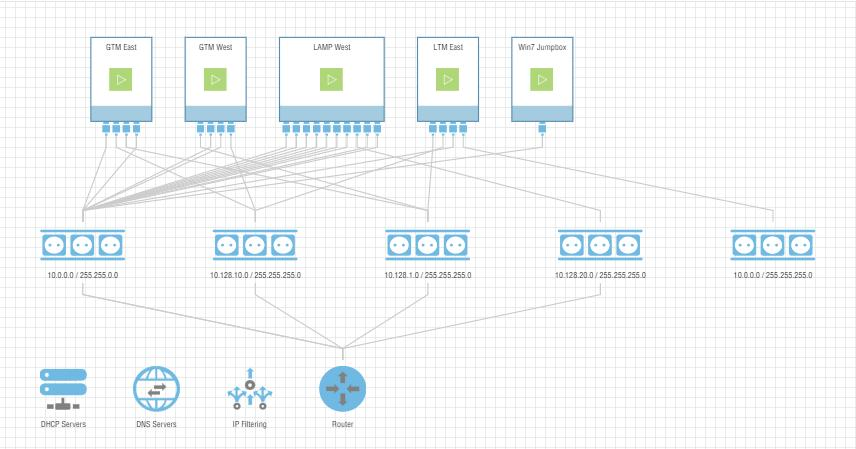
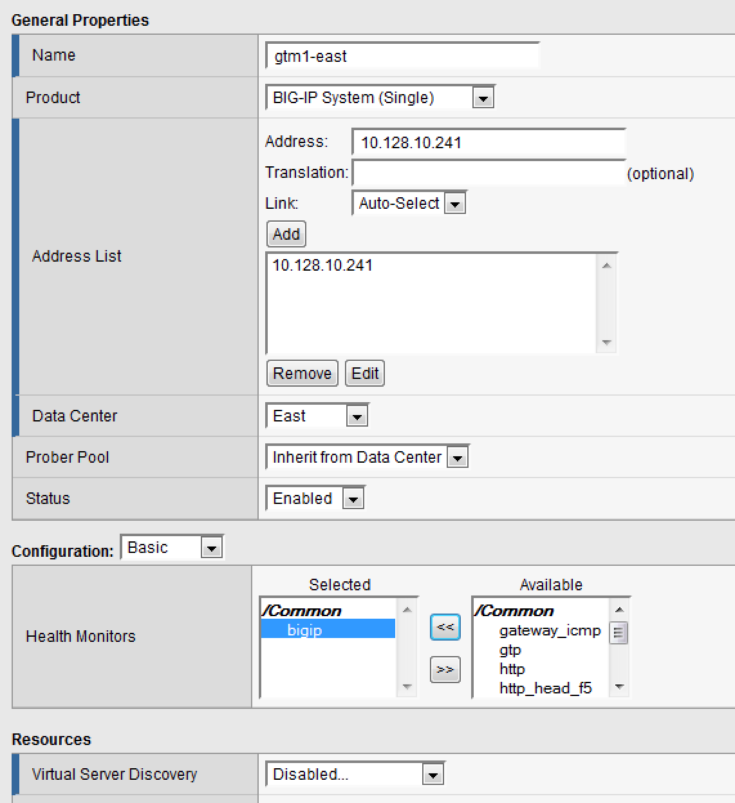
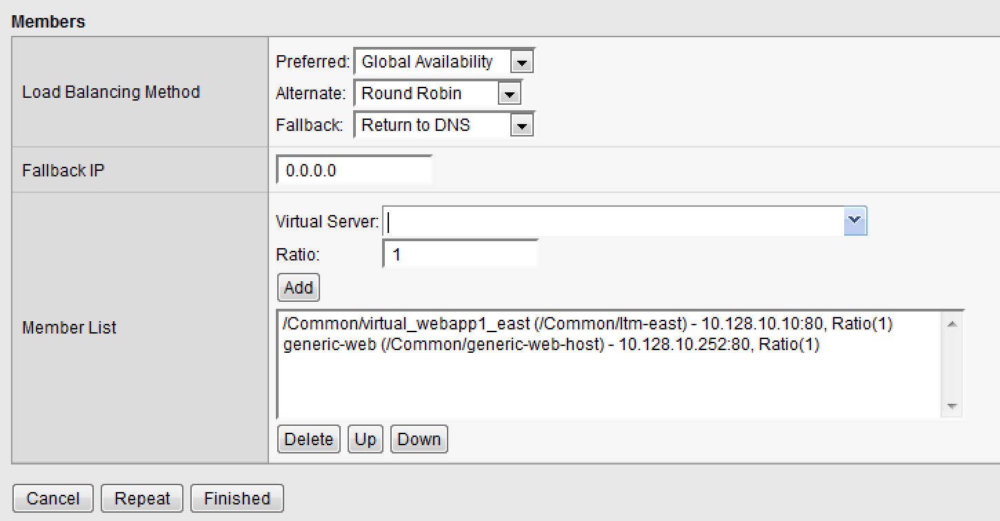
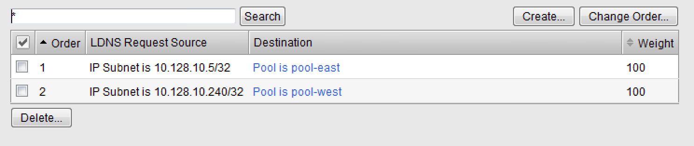
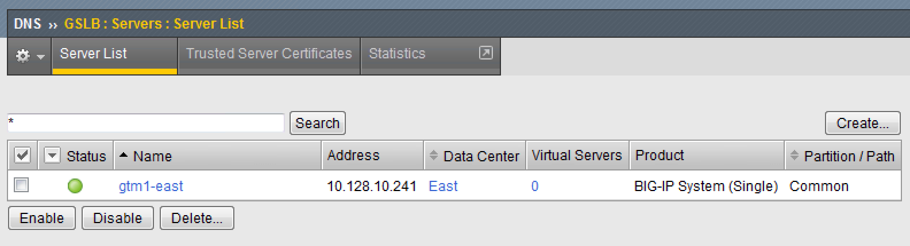
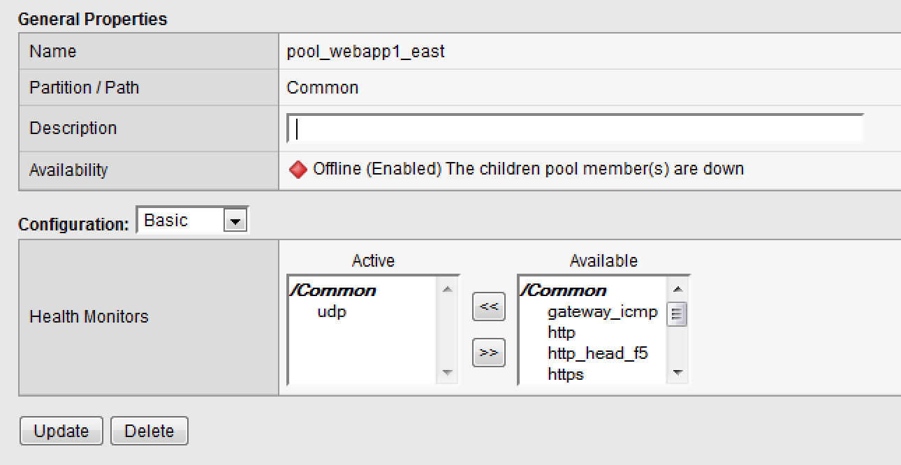
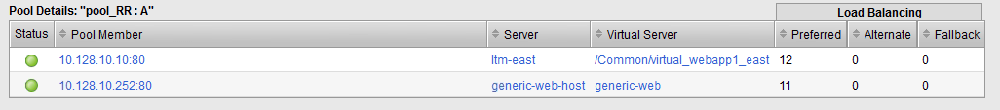
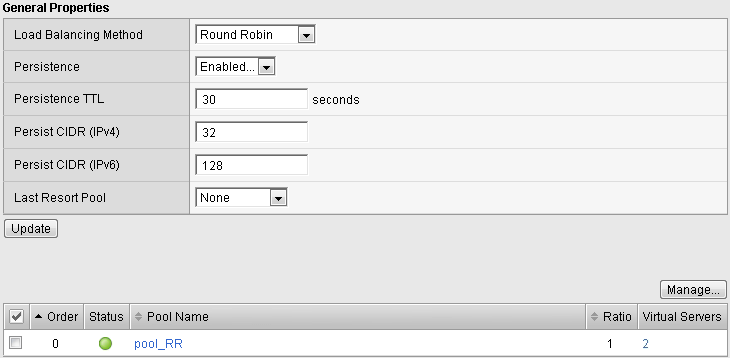
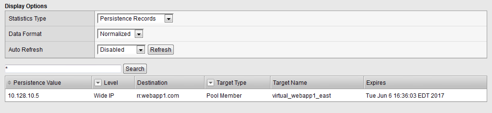

**BIG-IP DNS: Global Server Load Balancing**

    Written for: TMOS® v13.0

.. figure:: ./media/image1.jpg
   :alt: 
   :width: 0.87153in
   :height: 0.76389in

    Last Updated: 3/17/2016

DNS Lab – Getting Started

Your F5 has already been configured with the following:

-  Networking: VLANs, SelfIPs, Routing

-  DNS, NTP

Students will connect to the Win7 Jumpbox as shown below via a URL Link
from the Landing Page.

Your F5 devices are accessible via HTTPS and SSH from the Win7 Jumpbox
at:

GTM1 10.128.1.245 //Configuration for Lab Exercises 1.1 thru 2.3

GTM2 10.128.1.246 //Configuration for Lab Exercise 3.1

LTM-East 10.128.1.247 //Used for Lab Exercises 1.1 thru 3.1

Lamp-West 10.0.0.10 //Used for Lab Exercises 1.1 thru 3.1

To access your Ravello Lab Environment, from either Chrome or Mozilla
Browser connect to the Ravello Training Portal \ **(Ask an instructor
for the IP address)**

Type in your username such as ***dns101\_student1***,
***dns101\_student2***, etc.. with a shared password of "**DnS101**"

Select ‘View’ Under the Actions Column associated with the DNS101 lab.

 

Once you are logged in, you will see the URL for your specific windows
jump box needed to proceed with the lab.  A student view:

 

.. figure:: ./media/image3.png
   :alt: 
   :width: 7.05000in
   :height: 2.96064in

NOTE: All of the VMs should be in a STARTED state, if a VM is in any
other state please let the Lab Instructors know or you can attempt to
RESTART the VM yourself.

Select and Highlight then COPY the URL Link located under the DNS
section

Open up a Remote Desktop Client on your Laptop and Paste the DNS URL
Link from the Ravello Login screen.

Username: **Student**

Password: **F5@GilitY!** //This is the same password for all Student
Logins

 

.. figure:: ./media/image4.jpeg
   :alt: 
   :width: 4.37014in
   :height: 2.68472in

**-**\ Use Mozilla Browser on the Jumpbox and login to **LTM
(10.128.1.241)** & **GTM-EAST (10.128.1.246)**

-Login as = **admin/agility**

BIG-IP DNS: Global Server Load Balancing
========================================

Exercise 1.1 – Initial Setup
============================

-  **Objective:** To start off the labs, you will run through some basic
   configuration steps to get **GTM1 (10.128.1.246)** up and
   operational. Networking and NTP are already configured. You will be
   configuring the following:

   -  DNS Logging

   -  DNS Profile and Listeners

   -  Data Centers

   -  Server Objects

   -  Local LTM Virtual Server

-  Estimated completion time: 25 minutes

TASK 1 – Configuring DNS Logging
~~~~~~~~~~~~~~~~~~~~~~~~~~~~~~~~

-  You are going to configure DNS query and response logging. To do >
   this, you must tell GTM where to send logs to (a log publisher) > and
   what specifically to log (DNS logging profile).

-  For lab purposes, we are going to use local-syslog as our > logging
   destination. *Note that remote high speed logging is the >
   recommendation for production environments.*

-  In the GUI, navigate to: **System > Logs > Configuration > > Log
   Publishers: Create**

-  Create a new DNS Log Publisher as shown in the table below. Keep the
   > defaults if not noted in the table.

+--------------------+------------------------------------------------+
| **Name**           | dns-local-syslog                               |
+====================+================================================+
| **Destinations**   | Move dns-local-syslog to the Selected column   |
+--------------------+------------------------------------------------+
|                    | Click Finished                                 |
+--------------------+------------------------------------------------+

-  In the GUI, navigate to: **DNS > Delivery > Profiles > > Other > DNS
   Logging: Create**

-  Create a new DNS logging profile as shown in the table below. Keep >
   the defaults if not noted in the table.

+------------------------+---------------------------+
| **Name**               | dns-logging               |
+========================+===========================+
| **Log Publisher**      | Select dns-local-syslog   |
+------------------------+---------------------------+
| **Log Responses**      | Enabled                   |
+------------------------+---------------------------+
| **Include Query ID**   | Enabled                   |
+------------------------+---------------------------+
|                        | Click Finished            |
+------------------------+---------------------------+

-  Your new dns-logging profile should now have all options enabled.

TASK 2 – Create a DNS Profile
~~~~~~~~~~~~~~~~~~~~~~~~~~~~~

-  A DNS profile tells the DNS Listener how to process DNS traffic. >
   We’re going to make some basic tweaks.

-  In the GUI, navigate to: **DNS > Delivery > Profiles > DNS: >
   Create**

-  Create a new DNS profile as shown in the following table. Keep the >
   defaults if not noted in the table.

+---------------------------------+------------------+
| **Name**                        | my\_dns          |
+=================================+==================+
| **Unhandled Query Action**      | Drop             |
+---------------------------------+------------------+
| **Use BIND Server on Big-IP**   | Disabled         |
+---------------------------------+------------------+
| **Logging**                     | Enabled          |
+---------------------------------+------------------+
| **Logging Profile**             | dns-logging      |
+---------------------------------+------------------+
|                                 | Click Finished   |
+---------------------------------+------------------+

TASK 3 – Create a Listener
~~~~~~~~~~~~~~~~~~~~~~~~~~

We are going to create UDP/TCP external Listeners. You will use this IP
as a target address when querying GTM.

In the GUI, navigate to: **DNS > Delivery > Listeners > Listener List:
Create**

-  Create two external Listeners as shown in the tables below. Keep the
   > defaults if not noted in the table.

+-------------------------+-----------------------+
| **Name**                | Listener-UDP          |
+=========================+=======================+
| **Destination**         | Host: 10.128.10.245   |
+-------------------------+-----------------------+
| **VLAN Traffic**        | Enabled on..          |
+-------------------------+-----------------------+
| **VLANs and Tunnels**   | External              |
+-------------------------+-----------------------+
| **DNS Profile**         | my\_dns               |
+-------------------------+-----------------------+
|                         | Click Finished        |
+-------------------------+-----------------------+

+-------------------------+-----------------------+
| **Name**                | Listener-TCP          |
+=========================+=======================+
| **Destination**         | Host: 10.128.10.245   |
+-------------------------+-----------------------+
| **VLAN Traffic**        | Enabled on..          |
+-------------------------+-----------------------+
| **VLANs and Tunnels**   | external              |
+-------------------------+-----------------------+
| **Protocol **           | TCP                   |
+-------------------------+-----------------------+
| **DNS Profile**         | my\_dns               |
+-------------------------+-----------------------+
|                         | Click Finished        |
+-------------------------+-----------------------+

TASK 4 – Create Data Centers
~~~~~~~~~~~~~~~~~~~~~~~~~~~~

-  In the GUI, navigate to: **DNS > GSLB > Data Centers > Data > Center
   List: Create**

-  Create two Data Centers as shown below. Leave all defaults unless >
   otherwise noted:

+----------------+------------------+
| **Name**       | East             |
+================+==================+
| **Location**   | New York         |
+----------------+------------------+
|                | Click Finished   |
+----------------+------------------+

+----------------+------------------+
| **Name**       | West             |
+================+==================+
| **Location**   | Seattle          |
+----------------+------------------+
|                | Click Finished   |
+----------------+------------------+

-  Your Data Center list should look like the diagram below. Why is the
   > status blue?

   .. figure:: ./media/image5.png
      :alt: 
      :width: 5.48936in
      :height: 1.03219in

TASK 5 – Create GTM Server Object
~~~~~~~~~~~~~~~~~~~~~~~~~~~~~~~~~

By default, GTM is not self-aware. You will need to configure your BigIP
as a server object.

-  In the GUI, navigate to: **DNS > GSLB > Servers > Server > List:
   Create**

-  Create a Server Object as defined in the table and diagram below. >
   Leave default values unless otherwise noted:

+--------------------------------+-----------------------+
| **Name**                       | gtm1-east             |
+================================+=======================+
| **Product**                    | Big-IP (Single)       |
+--------------------------------+-----------------------+
| **Address List**               | 10.128.10.241 (Add)   |
+--------------------------------+-----------------------+
| **Data Center**                | East                  |
+--------------------------------+-----------------------+
| **Health Monitors**            | Bigip                 |
+--------------------------------+-----------------------+
| **Virtual Server Discovery**   | Disabled              |
+--------------------------------+-----------------------+
|                                | Click Create          |
+--------------------------------+-----------------------+

-  Click on the “Server List” tab at the top menu bar to refresh the
   page. You should see the Server object as green.

   | |image0|
   | What is the status of the East Data Center object now?

TASK 6 – Create LTM Server Object
~~~~~~~~~~~~~~~~~~~~~~~~~~~~~~~~~

Students will be using an LTM object to serve as the East-LTM. You will
need to create another BigIP object to do this. Prior to configuring the
Server object, we need to establish trust between the GTM and LTM. The
bigip\_add script will exchange device certificates to establish a trust
relationship.

-  Login via SSH using putty to your GTM1 (10.128.1.245) using username:
   **root** password: **agility**

-  | Issue the following commands.
   | **bigip\_add 10.128.1.245**

   Type ‘\ **yes**\ ’ to proceed and enter ‘\ **agility**\ ’ as the
   password.

   | Now type:
   | **big3d\_install 10.128.1.245**

   Note that this script likely won’t need to install a new version of
   the big3d agent… this is just for you to be familiar with the script.

-  From the GTM1 GUI, navigate to: **DNS > GSLB > Servers> > Server
   List: Create**

-  Create a Server Object as defined in the table and diagram below. >
   Leave default values unless otherwise noted:

+--------------------------------+-----------------------+
| **Name**                       | ltm-east              |
+================================+=======================+
| **Product**                    | Big-IP (Single)       |
+--------------------------------+-----------------------+
| **Address List**               | 10.128.10.240 (Add)   |
+--------------------------------+-----------------------+
| **Data Center**                | East                  |
+--------------------------------+-----------------------+
| **Health Monitors**            | Bigip                 |
+--------------------------------+-----------------------+
| **Virtual Server Discovery**   | Enabled               |
+--------------------------------+-----------------------+
|                                | Click Create          |
+--------------------------------+-----------------------+

-  After a few moments, click on the “Server List” tab at the top menu >
   bar to refresh the page. You should see the Server object > as green.
   You should also see virtual servers auto-discovered. > Below is a
   sample of what your screen should look like:

   .. figure:: ./media/image8.png
      :alt: 
      :width: 5.67579in
      :height: 1.79968in

-  | Go to your SSH session on GTM1 and take a look at the /var/log/gtm
     > file to see what kinds of logs are generated after a server is >
     created.
   | >
   | > **tail -100 /var/log/gtm
     > **

TASK 7 – Create Generic Server Object
~~~~~~~~~~~~~~~~~~~~~~~~~~~~~~~~~~~~~

GTM can handle virtual servers that do not reside on a BigIP. The most
common way of incorporating non-F5 virtual server is using a Server type
of Generic Host.

-  In the GUI, navigate to: **DNS > GSLB > Servers > Server > List:
   Create**

-  Create a Server Object as defined in the diagram below. Note that >
   the web virtual server is manually configured here and happens to >
   be the same IP address as the physical host.

   .. figure:: ./media/image9.png
      :alt: 
      :width: 5.53020in
      :height: 8.46796in

   After a few moments, click on the “Server List” tab at the top menu
   bar to refresh the page. You should eventually see the Server object
   as green.

   .. figure:: ./media/image10.png
      :alt: 
      :width: 5.59245in
      :height: 1.24332in

TASK 8 – Create LTM Virtual Servers
~~~~~~~~~~~~~~~~~~~~~~~~~~~~~~~~~~~

Finally, we need to create another virtual server on our **LTM–East**
(10.128.1.245)

-  Login to https://10.128.1.245 with admin\\agility if you haven’t >
   already

-  In the GUI, navigate to: **Local Traffic > Pools > Pool List: >
   Create**

-  Create a LTM Pool as defined in the table below. Leave default >
   values unless otherwise noted:

+------------------------+-------------------------+
| **Name**               | pool\_webapp1\_east     |
+========================+=========================+
| **Health Monitors**    | http                    |
+------------------------+-------------------------+
| **New Members**        | Address: 10.128.20.11   |
+------------------------+-------------------------+
|                        | Service Port: 80        |
|                        | Address: 10.128.20.12   |
+------------------------+-------------------------+
|                        | Service Port: 80        |
+------------------------+-------------------------+
|                        | Click Finished          |
+------------------------+-------------------------+

-  In the GUI, navigate to: **Local Traffic > Virtual Servers > >
   Virtual Server List: Create**

-  Create a Virtual Server as defined in the table and diagram below. >
   Leave default values unless otherwise noted:

+----------------------------------+--------------------------+
| **Name**                         | virtual\_webapp1\_east   |
+==================================+==========================+
| **Destination (Host)**           | 10.128.10.10             |
+----------------------------------+--------------------------+
| **Service Port**                 | 80                       |
+----------------------------------+--------------------------+
| **Source Address Translation**   | Auto Map                 |
+----------------------------------+--------------------------+
| **Default Pool**                 | pool\_webapp1\_east      |
+----------------------------------+--------------------------+

\*\*\ **Test new east coast virtual server in browser by hitting :
http://10.128.10.110**

-  Return to GTM1 GUI and navigate to: **DNS > GSLB > > Servers > Server
   List.** You should now see that the > **gtm1-east** has
   auto-discovered 1 new Virtual Server for the > **ltm-east** server
   for a total of 2 Virtual Servers.

   .. figure:: ./media/image11.tiff
      :alt: 
      :width: 6.25912in
      :height: 2.17639in

-  In the GUI, navigate to: **Statistics > Module Statistics > > DNS >
   GSLB.** Select “iQuery” from the **Statistics > Type** menu.

   STOP – You have completed lab 1

Exercise 2.1 – GSLB Active/Standby Data Centers
===============================================

-  In this use-case, you will configure a WideIP for a disaster recovery
   scenario. In this case, East will always be preferred while West is
   only used if East is down.

-  Estimated completion time: 10 minutes

TASK 1 – Create a GTM Pool
~~~~~~~~~~~~~~~~~~~~~~~~~~

-  From the GTM1 GUI, navigate to: **DNS > GSLB > Pools > Pool > List:
   Create.** Create a new Pool as shown in the table and > diagram
   below. Keep the defaults if not noted in the table.

+------------------------------+-----------------------------------------+
| **Name**                     | pool\_DR                                |
+==============================+=========================================+
| **Type**                     | A                                       |
+------------------------------+-----------------------------------------+
| **Load Balancing Method**    | Preferred: Global Availability          |
+------------------------------+-----------------------------------------+
| **Virtual Servers**          | Virtual\_webapp1\_east – 10.128.10.10   |
+------------------------------+-----------------------------------------+
|                              | Generic\_host\_west – 10.128.10.252     |
+------------------------------+-----------------------------------------+

Make sure that the east VS is at the top of the Member List as shown
below. This is an ordered failover from top to bottom.

TASK 2 – Create a WideIP
~~~~~~~~~~~~~~~~~~~~~~~~

We will create a hostname to use as a Wide IP.

-  In the GUI, navigate to: **DNS > GSLB > Wide IPs > Wide IP > List:
   Create.** Create a new Wide IP as shown in the table below. > Keep
   the defaults if not noted in the table.

+-------------------------+------------------+
| **Name**                | dr.webapp1.com   |
+=========================+==================+
| **Type**                | A                |
+-------------------------+------------------+
| **Pools – Pool List**   | pool\_DR (Add)   |
+-------------------------+------------------+

-  Open a Command Prompt window on your Windows jump box and query your
   > Listener for the Wide IP. You may wish to issue this command >
   several times:

   **nslookup.dr.webapp1.com 10.128.10.245**

   Your results should look like the following example:

   .. figure:: ./media/image13.png
      :alt: 
      :width: 5.75912in
      :height: 2.91360in

   Try hitting `**http://dr.webapp1.com** <http://www.webapp1.com>`__ in
   a browser. You should get the East Coast Data Center every time.

   | Now is a good time to view query logging. In the SSH shell on the
     **GTM**, view the logs in /var/log/ltm:
   | **tail –f /var/log/ltm
     **

.. raw:: html

   <!-- -->

-  Now we are going to intentionally fail the east VS. To do this, we’re
   going to assign a bad monitor to the LTM VS to simulate the
   application failing. Before we do this, open an SSH session to your
   GTM1 and tail the log file:
   **tail –f /var/log/gtm**

.. raw:: html

   <!-- -->

-  While the log is updating, navigate in the LTM-East to **Local
   Traffic > Pools > Pool List.** Select the pool\_webapp1\_east pool.
   Change the selected Health Monitor to udp as shown below:

   | |image1|
   | The LTM pool will turn red in about 30 seconds and you will see log
     messages in /var/log/gtm show up showing that GTM has learned the
     health via iQuery.

   | Query the WideIP again from the Command Prompt and note the
     results. The west server IP should be returned.
   | **nslookup.dr.webapp1.com 10.128.10.245**

   10.128.10.252 <- Generic Host in the West Data Center

   You can also try refreshing the web page from a browser – you should
   be directed to the Node #3 (green headline)

-  Now go back and remove the https monitor on virtual-server-east-pool
   and put back the http monitor. Note the log messages in /var/log/gtm.

-  Query the WideIP again and note your results. Did it fail back?

TASK 3 – Configure Fallback
~~~~~~~~~~~~~~~~~~~~~~~~~~~

We will create a scenario for a fallback option when both east and west
Virtual Servers are unavailable.

-  In the GTM1 GUI, navigate to : **DNS > GSLB > Pools > Pool List.**
   Select the pool **pool\_DR**. Select the **Members** tab in the
   middle menu bar. Make the following changes as noted in the table.

+----------------------------------------------------------------+
| **Load Balancing Method ** Preferred: Global Availability      |
| Alternate: None                                                |
+----------------------------------------------------------------+
| Fallback: Fallback IP                                          |
+----------------------------------------------------------------+

**Fallback IPv4 ** 1.1.1.1
--------------------------------------------------------------

-  Click **Update**

-  Now highlight both members in the checkboxes to the left and click
   **Disable**. Your GUI should look similar to the following diagram:

   .. figure:: ./media/image15.png
      :alt: 
      :width: 5.57025in
      :height: 2.63314in

-  | In the Command Prompt window, query the WideIP again and note the
     results. They should look similar to below and show fallback:
   | **nslookup.dr.webapp1.com 10.128.10.245**

   1. Fallback IP address which can be a sorry server for maintenance

-  Return to the GTM1 GUI go to **Statistics > Module Statistics > DNS >
   GSLB.** Under ‘Statistics Type’, select **Pools.** You should see
   statistics for Preferred, Alternate, and Fallback algorithms. You
   should see Fallback statistics updated:

   .. figure:: ./media/image16.tiff
      :alt: 
      :width: 5.67852in
      :height: 1.92584in

-  Go back and re-enable your pool members.

Exercise 2.2 – GSLB Active/Active Data Centers
==============================================

-  In this use-case, you will configure a WideIP that sends clients to
   both East and West Data Centers. This will involve scenarios with and
   without persistence.

-  Estimated completion time: 15 minutes

TASK 1 – Create a GTM Pool
~~~~~~~~~~~~~~~~~~~~~~~~~~

-  In the GUI on your GTM, navigate to: **DNS > GSLB > Pools > > Pool
   List: Create.** Create a new Pool as shown in the table and > diagram
   below. Keep the defaults if not noted in the table.

+------------------------------+-----------------------------------------+
| **Name**                     | pool\_RR                                |
+==============================+=========================================+
| **Type**                     | A                                       |
+------------------------------+-----------------------------------------+
| **Load Balancing Method**    | Preferred: Round Robin (default)        |
+------------------------------+-----------------------------------------+
| **Add Virtual Servers**      | Virtual\_webapp1\_east – 10.128.10.10   |
+------------------------------+-----------------------------------------+
|                              | generic\_web – 10.128.10.252            |
+------------------------------+-----------------------------------------+
|                              | Click Finished                          |
+------------------------------+-----------------------------------------+

TASK 2 – Create a WideIP
~~~~~~~~~~~~~~~~~~~~~~~~

We will create a hostname to use as a Wide IP.

-  In the GUI, navigate to: **DNS > GSLB > Wide IPs > Wide IP > List:
   Create.** Create a new Wide IP as shown in the table below. > Keep
   the defaults if not noted in the table.

+-------------------------+------------------+
| **Name**                | rr.webapp1.com   |
+=========================+==================+
| **Type**                | A                |
+-------------------------+------------------+
| **Pools – Pool List**   | pool\_RR (Add)   |
+-------------------------+------------------+
|                         | Click Finished   |
+-------------------------+------------------+

-  From Command Prompt on your Windows machine, query your Listener for
   > the Wide IP. You may wish to issue this command several times:

   **nslookup.rr.webapp1.com 10.128.10.245**

   You should see the east and west coast IPs returned in a round robin
   fashion - sometimes 2 in a row for each due to the multiple instances
   of TMM running on the virtual appliance.

   You can also see the results in a browser by going to
   `**http://rr.webapp1.com** <http://rr.webapp1.com>`__

   Refresh the page several times and you should see the round robin
   behavior in the browser.

-  Your results should have round robin of answers going between east
   and west Virtual Servers.

-  | From GTM1 GUI to **Statistics > Module Statistics > DNS > GSLB.**
     Under ‘Statistics Type’, select **Pools.** Click on **View** under
     the ‘Members’ column for **pool\_RR**. You should see an even
     distribution between members similar to the diagram below:
   | |image2|

TASK 3 – Adding WideIP Alias
~~~~~~~~~~~~~~~~~~~~~~~~~~~~

GTM allows for a single WideIP configuration to be used for multiple
names, including wildcards. We are going to add a domain name and an
example wildcard.

-  In the GUI, navigate to: **DNS > GSLB > Wide IPs > Wide IP List.**
   Select ***rr.webapp1.com*** and change **General Properties** to
   **Advanced**. Under the Alias List, add the following entries as
   shown in the diagram below.

-  webapp1.com

-  r\*.webapp1.com

-  .. figure:: ./media/image18.png
      :alt: 
      :width: 5.85948in
      :height: 6.66694in

-  Issue each of the following DNS queries multiple times from a Command
   Prompt:

-  nslookup.webapp1.com 10.128.10.245

-  nslookup.rooster.webapp1.com 10.128.10.245

   Do you see a round robin behavior with above names as expected?

TASK 4 – Adding Persistence
~~~~~~~~~~~~~~~~~~~~~~~~~~~

Many applications require session persistence. As a result, GTM needs to
send clients to the same Data Center via GSLB-level persistence.

-  From the GTM1 GUI, navigate to: **DNS > GSLB > Wide IPs > Wide IP
   List.** Select ***rr.webapp1.com***. Select **Pools** from the middle
   menu bar. Make the following changes

-  Enable Persistence

-  Change the Persistence TTL to 30 seconds

-  Click **Update
   **\ |image3|

-  From Command Prompt, query the WideIP ***rr.webapp1.com*** several
   times and note the results. Do you see the same response each time?

-  In the GUI, navigate to: **Statistics > Module Statistics > DNS >
   GSLB.** Under ‘Statistics Type’, select **Persistence Records.** Note
   that because the Persistence TTL is only 30 seconds, you may need to
   send another query to generate a record. After 30 seconds expires,
   you should note the record disappearing.

-  **\*\*NOTE:** As of v12, persistence record statistics and logging is
   disabled. If you get the error message in the GUI, follow the
   directions and run the following from the CLI on GTM1. This will
   change the DB variable to allow you to view the persistence records
   in the GUI:

   **tmsh**

   **modify sys db
   ui.statistics.modulestatistics.dnsgslb.persistencerecords value
   true**

-  | Query the Wide IP again and then refresh the persistence record
     screen in the GUI
   | |image4|

Exercise 2.3 – GSLB with Topology
=================================

-  In this use-case, you will send clients to a preferred geographic
   location using Topology. We are also going to incorporate the use of
   multiple pools in this lab to introduce WideIP-level load balancing.

-  Estimated completion time: 10 minutes

TASK 1 – Create GTM Pools
~~~~~~~~~~~~~~~~~~~~~~~~~

-  From the GTM1 GUI, navigate to: **DNS > GSLB > Pools > Pool > List:
   Create.** Create new Pools as shown in the table and > diagram below.
   Keep the defaults if not noted in the table.

+-------------------+-------------------------------------------------------+
| **Name**          | pool-east                                             |
+===================+=======================================================+
| **Type**          | A                                                     |
+-------------------+-------------------------------------------------------+
| **Load Balancing  | Preferred: Global Availability                        |
| Method**          |                                                       |
+-------------------+-------------------------------------------------------+
| **Add Virtual     | Virtual\_webapp1\_east - 10.128.10.10:80              |
| Servers**         |                                                       |
+-------------------+-------------------------------------------------------+
|                   | generic\_web – 10.128.10.252:80 (add this in case the |
|                   | east server becomes unavailable)                      |
+-------------------+-------------------------------------------------------+
|                   | Click Finished                                        |
+-------------------+-------------------------------------------------------+

+-----------------------------+--------------------------+
| **Name**                    | pool-west                |
+=============================+==========================+
| **Type**                    | A                        |
+-----------------------------+--------------------------+
| **Load Balancing Method**   | Preferred: Round Robin   |
+-----------------------------+--------------------------+
| **Virtual Servers**         | generic\_web             |
+-----------------------------+--------------------------+
|                             | Click Finished           |
+-----------------------------+--------------------------+

TASK 2 – Create Topology Records
~~~~~~~~~~~~~~~~~~~~~~~~~~~~~~~~

We will create topology records to define source IPs that will prefer
east or west Data Centers. We are going to have your workstation prefer
east, while LTM-east host will prefer west.

-  In the GUI, navigate to: **DNS > GSLB > Topology > > Records:
   Create.** Create two new records as shown in the tables > below:

   **Topology Record 1**

+---------------------------------------+---------------------------------+
| **Request Source**                    | IP Subnet is 10.128.10.247/32   |
+=======================================+=================================+
| **Destination - Pools – Pool List**   | pool\_west                      |
+---------------------------------------+---------------------------------+
| **Weight**                            | 100                             |
+---------------------------------------+---------------------------------+

**Topology Record 2**

+---------------------------------------+----------------------------+
| **Request Source**                    | IP Subnet is 10.0.0.0/24   |
+=======================================+============================+
| **Destination - Pools – Pool List**   | pool\_east                 |
+---------------------------------------+----------------------------+
| **Weight**                            | 100                        |
+---------------------------------------+----------------------------+

TASK 3 – Create a WideIP
~~~~~~~~~~~~~~~~~~~~~~~~

We will create a hostname to use as a Wide IP for Toplogy LB.

-  From the GTM1 GUI, navigate to: **DNS > GSLB > Wide IPs > > Wide IP
   List: Create.** Create a new Wide IP as shown in the > table below.
   Keep the defaults if not noted in the table.

+------------------------------+------------------------+
| **Name**                     | topology.webapp1.com   |
+==============================+========================+
| **Type**                     | A                      |
+------------------------------+------------------------+
| **Load Balancing Method**    | Topology               |
+------------------------------+------------------------+
| **Pool List**                | pool\_east (add)       |
|                              | pool\_west (add)       |
+------------------------------+------------------------+

-  Issue the following DNS query multiple times from a command prompt on
   your Windows workstation:

-  nslookup topology.webapp1.com 10.128.10.245

   You should see the IP address for the East Data Center – 10.128.10.10
   because you are coming from 10.128.10.5 which falls under Topology
   Record #1 that you created above.

-  Open an SSH session to the LTM-east if you don’t have one open
   already.

-  IP: 10.128.1.245

-  User/pass: root/agility

-  Issue the following DNS query multiple times:

   -  tmsh dig @10.128.10.245 topology.webapp1.com

      You should see the IP address for the generic web server in the
      west data center returned (10.128.10.252).

      .. figure:: ./media/image22.png
         :alt: 
         :width: 5.59041in
         :height: 2.51932in

Exercise 3.1 – Creating a Synchronization Group
===============================================

-  In this use-case, you will create a sync group to be used between
   GTM1 and GTM2

   -  GTM1 will be used as the “existing GTM”.

   -  GTM2 will be used as the “new GTM”. This unit will end up
      consuming and having a copy of the config from the “existing GTM”.

-  Estimated completion time: 15 minutes

TASK 1 – Create Server Object on GTM1
~~~~~~~~~~~~~~~~~~~~~~~~~~~~~~~~~~~~~

-  Log in to **GTM2 (10.128.1.247)** using admin\\agility and notice >
   there is no DNS WideIPs, servers, or data centers configured

-  From GTM1 we will need to add GTM2 as a Server object.

-  From **GTM1** GUI, navigate to: **DNS > GSLB > Servers > > Server
   List: Create**

+--------------------------------+-----------------------+
| **Name**                       | gtm2-west             |
+================================+=======================+
| **Product**                    | Big-IP (Single)       |
+--------------------------------+-----------------------+
| **Address List**               | 10.128.10.247 (Add)   |
+--------------------------------+-----------------------+
| **Data Center**                | West                  |
+--------------------------------+-----------------------+
| **Health Monitors**            | Bigip                 |
+--------------------------------+-----------------------+
| **Virtual Server Discovery**   | Disabled              |
+--------------------------------+-----------------------+
|                                | Click Create          |
+--------------------------------+-----------------------+

-  .. rubric:: Notice the gtm2-west server object stays blue on the
      server list screen. This is because we haven’t created the trust
      between the devices yet.
      :name: notice-the-gtm2-west-server-object-stays-blue-on-the-server-list-screen.-this-is-because-we-havent-created-the-trust-between-the-devices-yet.

-  .. rubric:: From GTM1 SSH session, issue the following command.
      :name: from-gtm1-ssh-session-issue-the-following-command.

    **bigip\_add 10.128.10.242**

    Type ‘yes’ to proceed and enter ‘default’ as the password.

    \*\*Notice gtm2-west should have turned green in the server list

TASK 2 – Create a Synchronization Group
~~~~~~~~~~~~~~~~~~~~~~~~~~~~~~~~~~~~~~~

-  ***On GTM1*** in the GUI, navigate to: **DNS > Settings > > GSLB >
   General. **

-  Enable the **Synchronize** checkbox.

-  Change the Group Name as **Agility**

-  Enable the **Synchronize DNS Zone Files** checkbox.

   .. figure:: ./media/image23.png
      :alt: 
      :width: 2.51873in
      :height: 1.13924in

TASK 3 – Add New GTM to Synchronization Group
~~~~~~~~~~~~~~~~~~~~~~~~~~~~~~~~~~~~~~~~~~~~~

We will run the **gtm\_add** script to add the “new GTM” to the
synchronization group with the “existing GTM”. Note, **always run this
script on the NEW GTM device**. Running this script on the configured
GTM device will sync to the new device and erase the current
configuration! So be very careful!

-  Use PUTTY to log in to the new **gtm2 (10.128.1.247)** with
   root\\agility and run the following command:

   **gtm\_add 10.128.10.241**

   Type ‘\ **y**\ ’ to proceed. If prompted for a password use
   ‘agility’.

-  To validate the sync group is setup properly, navigate through the
   GUI to see if the configurations are the same. You may want to look
   at the Server definitions, Wide IPs, etc.

-  If the configs look equal, make a change on one GTM and see if it
   shows up on the other. Repeat in the reverse direction. \*\*\ **Note
   - There is NO MASTER! Any change on any GTM in a sync group is
   automatically replicated to all other GTMs in the group**.

-  From your workstation, query each Listener (gtm1 – 10.128.10.245 and
   gtm2 – 10.128.10.246) for a given Wide IP and verify that the
   responses are as expected.

